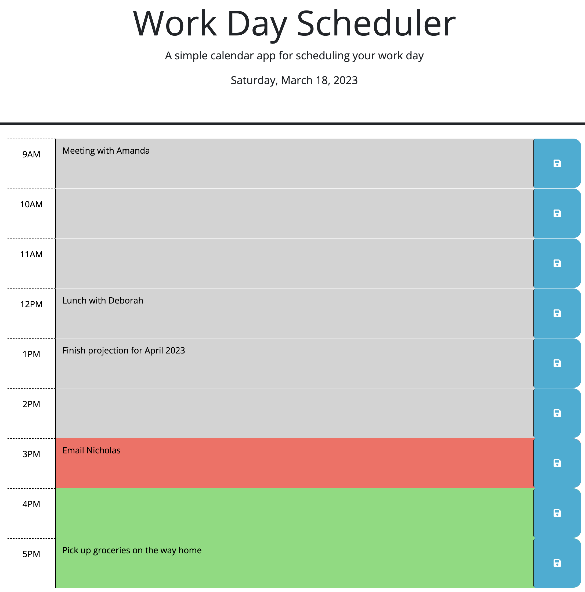

# Work Day Scheduler

## Description

This calendar app allows the user to store events they want to complete each hour of their business day.

Building this application, I learned about local storage.

## Installation

N/A

## Usage

Type your event into the corresponding hour.  Click the save icon to save your event to your calendar.

## Credits
- jQuery Selectors. (n.d.). W3Schools. Retrieved March 18, 2023, from https://www.w3schools.com/jquery/jquery_selectors.asp
- HTML textarea tag. (n.d.). W3Schools. Retrieved March 18, 2023, from https://www.w3schools.com/tags/tag_textarea.asp
- Hassan, U. (n.d.). How to Get Text Area Value in JavaScript? Linux Hint. Retrieved March 18, 2023, from https://linuxhint.com/get-text-area-value-in-javascript/
- Trying to use localStorage to store user-inputted text in textarea, but Save and Reload buttons are not working. (2022, January 1). Stack Overflow. Retrieved March 18, 2023, from https://stackoverflow.com/questions/70546999/trying-to-use-localstorage-to-store-user-inputted-text-in-textarea-but-save-and
- Tadlock, J. (n.d.). Course Overview. GitHibGist. Retrieved March 18, 2023, from https://zoom.us/rec/play/4Ohnp9wgDzs_yMcWSdy7xGL2JSmTE74Xq1uOnd50KuOHODiIpLM7P44oF4IzGPALGSBMKosrj4jpMklT.DYTsauXfu9yUHtCg?startTime=1679011478000&_x_zm_rtaid=8auYSd-XTrm0q9G7nzJrvA.1679160199239.4e9ca6f59bc6c59e7ab93f958f5f180c&_x_zm_rhtaid=871
- tutoring 18MAR2023, jQuery

## License

MIT License

## Deployed Application Link

<!-- Paste your deployed application link here. -->
